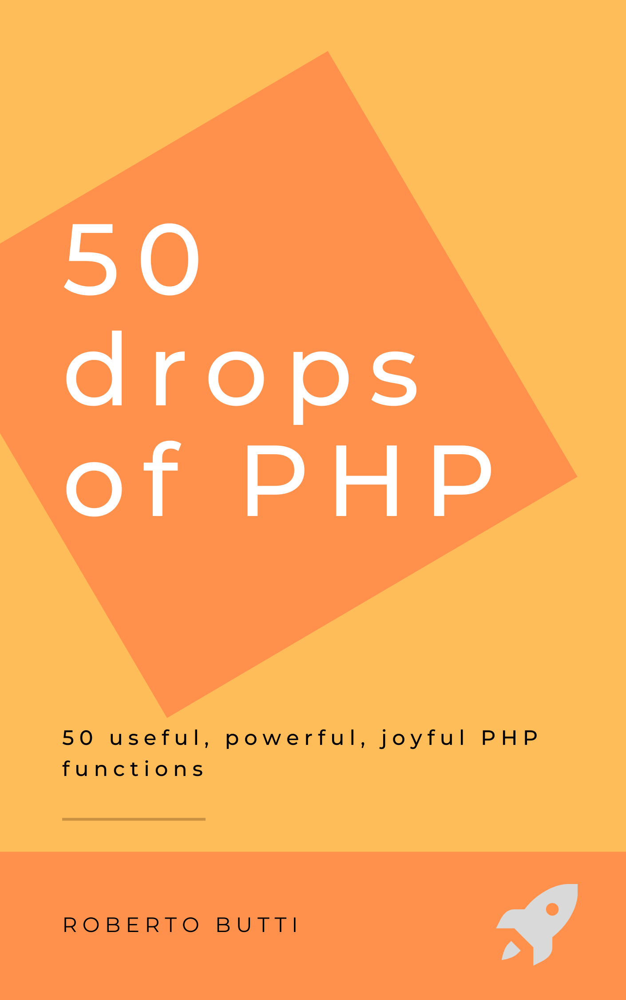

# The Book: 50 drops of PHP

 This book collects some useful, unknown, underrated PHP functions or stuff discovered, used, learned during the PHP daily use.

This book will show you 50 features that are typically underused or underrated.

Using frameworks on a daily basis, sometimes the perception of the power of the language and of the basic functionalities provided by the PHP core is lost.

